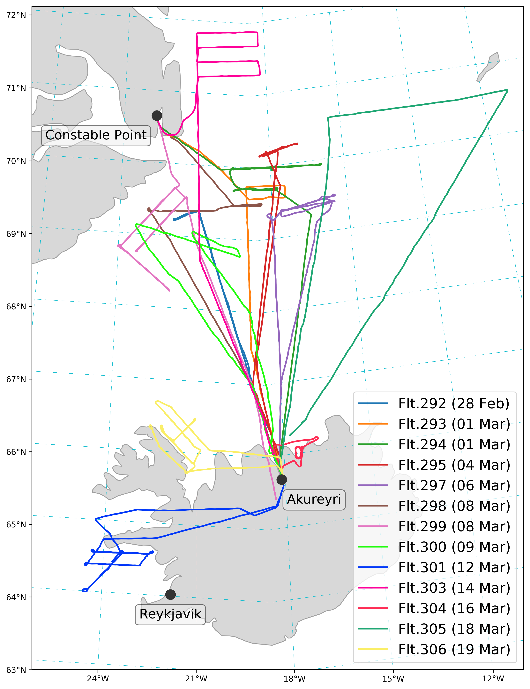

# All scientific flights 

  
  
IGP flight tracks and mean sea ice concentration (OSTIA)

  
  
IGP flight tracks, zoomed map

# Flight 292 

# Thanks!

<ul class="icon-list">
  <li><a href="https://github.com/IGPResearch/sandbox"><i class="fa fa-github -square fa-lg"></i>Code for figures: https://github.com/IGPResearch/sandbox</a></li>
  <li><a href="https://github.com/IGPResearch/20180511_igp_uea_meeting"><i class="fa fa-github -square fa-lg"></i>Code for figures: https://github.com/IGPResearch/20180511_igp_uea_meeting</a></li>
</ul>

<!--
-->
